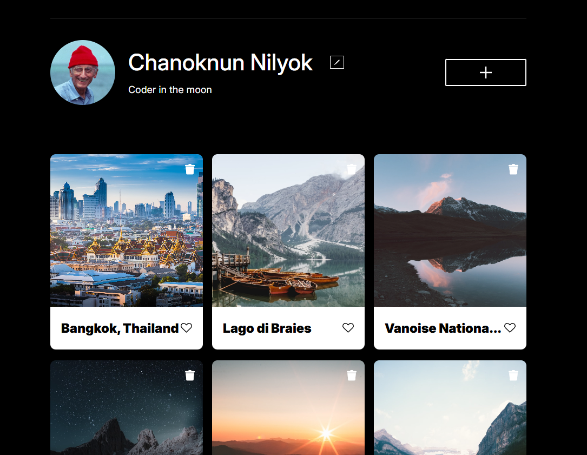

# Project 7: Checklist – se_project_aroundtheus

## 📋 Project Description
This project is an interactive web application called **Checklist**, part of the _se_project_aroundtheus_ assignment. It allows users to manage two types of content:

- A card-based photo gallery showcasing scenic places.

Users can edit their profile, add new places to the gallery with titles and image links, and interact with dynamic elements such as popups and form validation. This project emphasizes modular JavaScript structure, DOM manipulation, form validation, and dynamic rendering of components.

## 🛠️ Technologies & Techniques Used
- **HTML5** – Semantic structure for accessible content.
- **CSS3** – Responsive layout using Flexbox and BEM methodology.
- **JavaScript (ES6+)** – Modular components with classes.
  - `Card.js` for image cards
  - `FormValidator.js` for validating forms
- **DOM Manipulation** – Dynamically rendering cards and tasks using JavaScript templates.
- **Form Validation** – Custom validation logic using reusable configuration.
- **Responsive Design** – Works across multiple screen sizes.
- **Git** – Version control for collaboration and tracking changes.
- **GitHub Pages** – Deployment of the live project.

## 📸 Screenshots
> 
> - A sample card being added
> - The to-do section in action
> - Any modals or validation examples

## 🌐 Live Link
[Visit the project on GitHub Pages](https://github.com/Nilyok)
